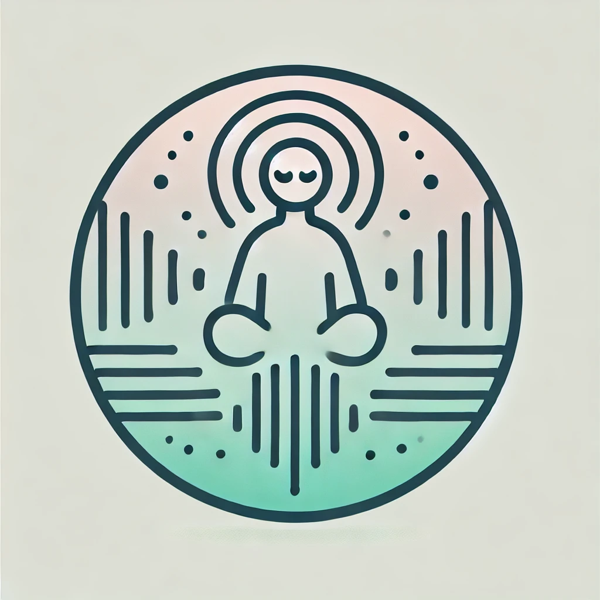

#  ZENFOCUS

## Descrição

ZENFOCUS é um projeto que oferece um timer regressivo com botões interativos, permitindo que o usuário escolha um som relaxante para tocar enquanto se concentra em uma tarefa. O timer define um período de foco de 10 minutos.

## Tecnologias Usadas

- [React](https://reactjs.org/): Para criar e gerenciar estados, além de renderizar o app dinamicamente.
- [TypeScript](https://www.typescriptlang.org/): Para trazer robustez e consistência ao app.
- [Styled-Components](https://styled-components.com/): Para criar estilos personalizados sem utilizar CSS.
- [Vite](https://vitejs.dev/): Um empacotador de aplicações que permite um desenvolvimento rápido e otimizado, com recarregamento instantâneo e suporte nativo para módulos ES.

## Uso

O projeto é intuitivo, permitindo que os usuários:

- Alternem entre os temas claro e escuro.
- Iniciem, pausem e parem (resetem) o timer.
- Escolham uma das quatro faixas relaxantes para tocar.
- Cliquem novamente nas faixas para pausar e mudarem para outra.

## Funcionalidades

- Alternância de temas claro e escuro.
- Contagem regressiva de 10 minutos.
- Seleção e controle de faixas de áudio relaxantes.

Desenvolvido por [guiBarbosa10](https://github.com/guiBarbosa10).